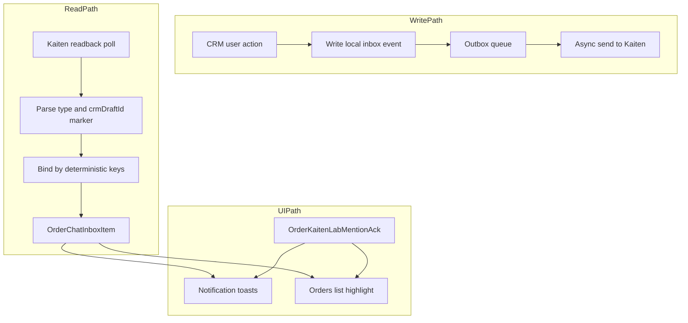

# План: минимальные риски и нулевое влияние на CRM

## Принципы

- Только детерминированные триггеры: `!!!`, `???`, `@tenantTag`.
- Только детерминированные ключи связи: `kaitenCommentId` и `crmDraftId`.
- Никаких эвристик: без similarity по тексту, автору, времени, fingerprint.
- Пользовательские действия в CRM не блокируются Kaiten: интеграция только асинхронная.
- Переключение обратимо за минуты через feature flag.

## Целевая архитектура

## Модель данных

### Новая таблица

- `OrderChatInboxItem` в [prisma/schema.prisma](prisma/schema.prisma)
- Поля:
  - `id`, `tenantId`, `orderId`
  - `type`: `CORRECTION | PROSTHETICS | LAB_MENTION`
  - `source`: `KAITEN | DEMO_KANBAN`
  - `text`, `authorLabel`, `createdAt`
  - `kaitenCommentId Int?`
  - `crmDraftId String?`
  - `syncState`: `PENDING_EXTERNAL | SYNCED_EXTERNAL | LOCAL_ONLY | FAILED_EXTERNAL`
  - `resolvedAt`, `resolvedByUserId`, `rejectedAt`, `rejectedByUserId` (только для `CORRECTION/PROSTHETICS`)

### Уникальные ключи

- `@@unique([orderId, type, kaitenCommentId])` when `kaitenCommentId IS NOT NULL`
- `@@unique([orderId, type, crmDraftId])` when `crmDraftId IS NOT NULL`

### Индексы

- `@@index([tenantId, type, createdAt])`
- `@@index([tenantId, type, resolvedAt, rejectedAt])`
- `@@index([orderId, type, resolvedAt, rejectedAt])`
- `@@index([orderId, syncState, createdAt])`

### ACK

- Сохраняем [OrderKaitenLabMentionAck](prisma/schema.prisma) в первой версии без изменений.
- Pending для `LAB_MENTION` считается только через `event.createdAt` vs `effectiveAck`.

## Алгоритм без эвристик

### CRM -> Kaiten

1. На действие пользователя создать inbox event с `crmDraftId` и `syncState=PENDING_EXTERNAL`.
2. Отправить комментарий в Kaiten через outbox worker.
3. В комментарий включить служебный маркер `crmDraftId`.
4. На readback связать запись строго по `crmDraftId`, проставить `kaitenCommentId`, `syncState=SYNCED_EXTERNAL`.
5. Если SLA истек и связи нет: `FAILED_EXTERNAL`, retry с тем же `crmDraftId` (без новых записей).

### Kaiten -> CRM

1. Получить комментарий, извлечь `kaitenCommentId`, `type`, `crmDraftId` (если есть).
2. Upsert строго по уникальным ключам.
3. Нет ключа -> новая запись; нет `crmDraftId` у внешнего комментария -> обычный upsert по `kaitenCommentId`.

## Стратегия внедрения без влияния на CRM

### S0. Freeze contracts

- Зафиксировать формат маркера `crmDraftId` и parser contract.
- Зафиксировать SLA для `PENDING_EXTERNAL`.
- Зафиксировать go/no-go и rollback criteria.

### S1. Schema + compat

- Добавить новую таблицу и индексы.
- Сделать backfill legacy данных без удаления legacy.
- Подключить compat слой в:
  - [lib/kanban/kaiten-comments-ingest-server.ts](lib/kanban/kaiten-comments-ingest-server.ts)
  - [app/api/orders/[id]/kanban-chat/route.ts](app/api/orders/[id]/kanban-chat/route.ts)

### S2. Dual-write

- Писать в old и new одновременно.
- Чтение оставить old.
- Логировать create/update/fail причины.

### S3. Dual-read compare

- Параллельно считать old/new для:
  - [lib/order-notification-toasts.server.ts](lib/order-notification-toasts.server.ts)
  - [lib/fetch-orders-list-page.ts](lib/fetch-orders-list-page.ts)
  - [lib/hydrate-order-kaiten-lab-mention-highlight.ts](lib/hydrate-order-kaiten-lab-mention-highlight.ts)
- UI по-прежнему показывает old-read.

### S4. Canary read-new

- Включить `read-new` только для canary tenants.
- Поддерживать мгновенный `read-legacy` rollback flag.

### S5. Full read-new

- Включить всем tenant.
- Оставить legacy write на 24-48 часов как страховку.

### S6. Cleanup

- Удалить legacy только после стабильного окна.
- После завершения синхронизировать SaaS по [sync-saas-from-lab.mdc](.cursor/rules/sync-saas-from-lab.mdc).

## Риск-аудит нового подхода

### R1. Потеря deterministic bind

- Симптом: `PENDING_EXTERNAL` старше SLA.
- Решение: retry с тем же `crmDraftId`, затем `FAILED_EXTERNAL`, без эвристик.

### R2. Повреждение/подмена маркера

- Симптом: CRM события не связываются с readback.
- Решение: строгая parser-валидация; malformed -> `FAILED_EXTERNAL`.

### R3. Ложные pending после backfill

- Симптом: всплеск `LAB_MENTION` уведомлений.
- Решение: только historical timestamps; запрет synthetic `now()` для unknown history.

### R4. Дубли событий

- Симптом: две активные записи одной природы.
- Решение: дедуп только по строгим ключам; запрет insert вне уникальных контрактов.

### R5. Регресс ack семантики

- Симптом: highlight/toasts гаснут некорректно.
- Решение: сохранить текущую ACK таблицу и пройти тест-матрицу own/global/no-ack.

### R6. Деградация производительности

- Симптом: рост p95 API toasts/list.
- Решение: индексный гейт + EXPLAIN + rollback flag.

### R7. Partial cutover

- Симптом: разные экраны показывают разные статусы.
- Решение: reader checklist до `read-new`:
  - [components/orders/OrderCorrectionToastStack.tsx](components/orders/OrderCorrectionToastStack.tsx)
  - [components/orders/OrderListKaitenPoller.tsx](components/orders/OrderListKaitenPoller.tsx)
  - [components/shipments/ShipmentsOrdersTable.tsx](components/shipments/ShipmentsOrdersTable.tsx)
  - [components/finance-office/FinanceOfficeOrdersTable.tsx](components/finance-office/FinanceOfficeOrdersTable.tsx)

## Метрики и пороги go/no-go

- `pending_count_delta(old,new)`
- `toast_payload_delta(old,new)`
- `highlight_delta(old,new)`
- `failed_external_count`
- `pending_external_age_p95`
- `api_p95_toasts_ms`
- `api_p95_orders_list_ms`

Переход к следующему этапу разрешён, если:

- дельты old/new в пределах согласованного порога;
- `failed_external_count` ниже порога;
- нет P1/P2 инцидентов 24 часа;
- p95 не вышел за лимит.

## Incident playbook

### Пропали уведомления

1. Включить `read-legacy`.
2. Запустить re-ingest для затронутых orders.
3. Проверить bind шаг и syncState переходы.

### Лишние уведомления

1. Частично отключить `LAB_MENTION` read-new.
2. Проверить backfill timestamps и ACK интерпретацию.
3. Пересчитать pending.

### Дубли

1. Проверить нарушение уникальных ключей.
2. Выполнить cleanup по строгим ключам.
3. Возобновить read-new после нулевой дельты.

## Критерии завершения

- S1: schema и backfill выполнены безопасно.
- S2: dual-write стабилен, критичных ошибок записи нет.
- S3: dual-read дельты стабильны и объяснимы.
- S4: canary проходит без инцидентов.
- S5: full read-new стабилен 24-48 часов.
- S6: legacy удалён, мониторинг зелёный.
