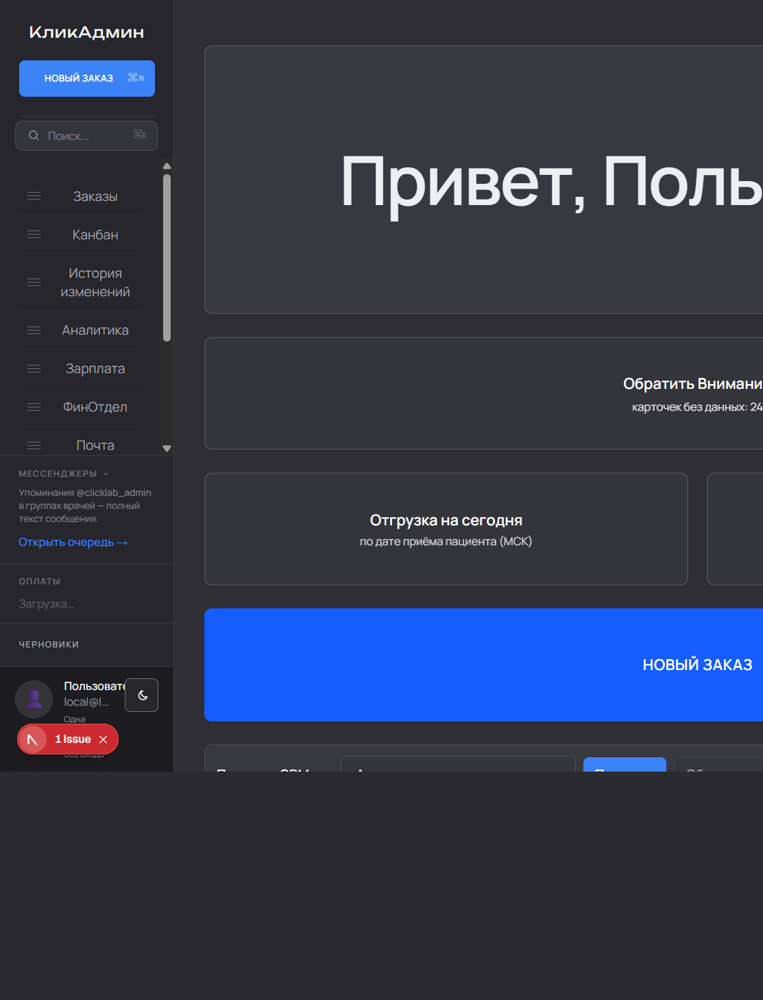
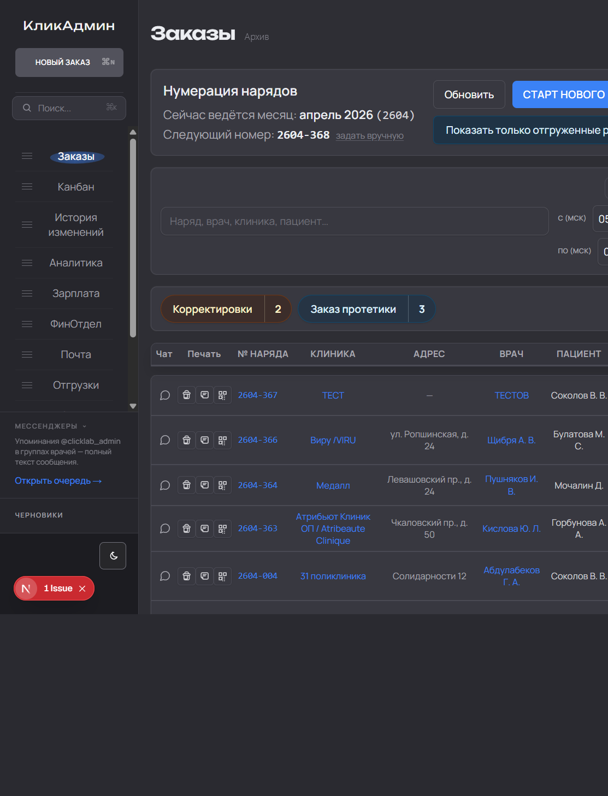
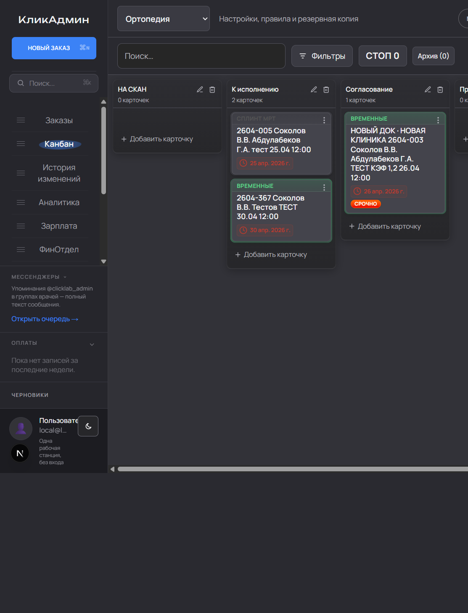
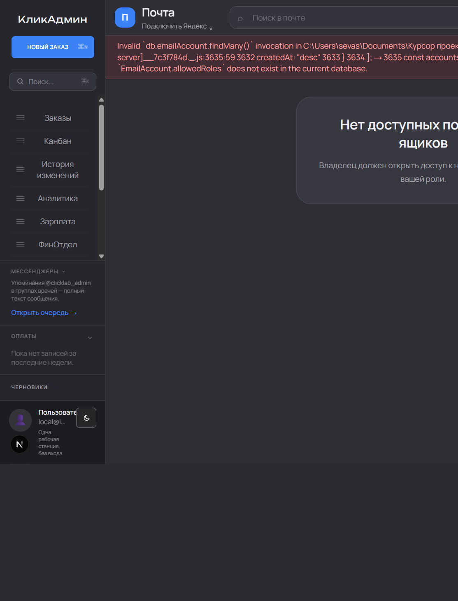
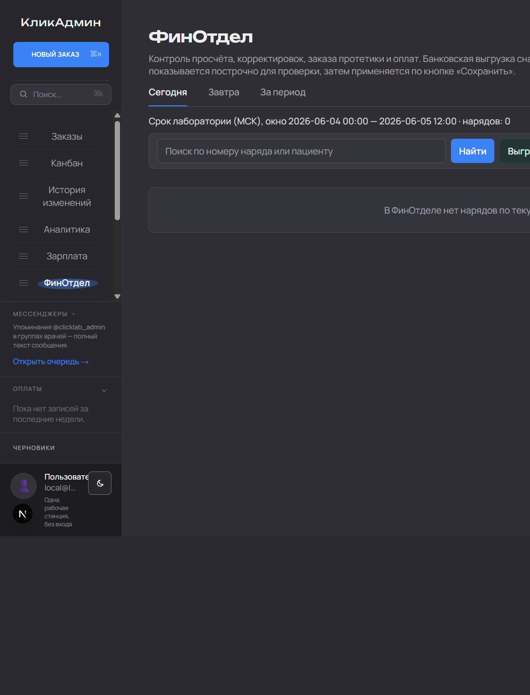
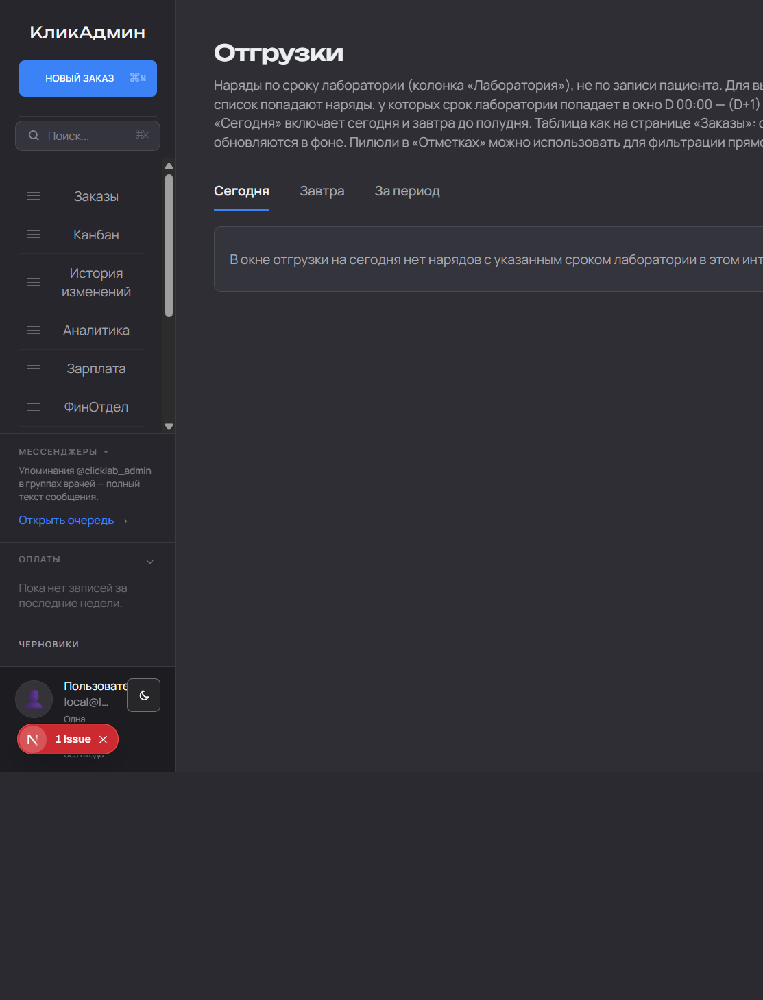
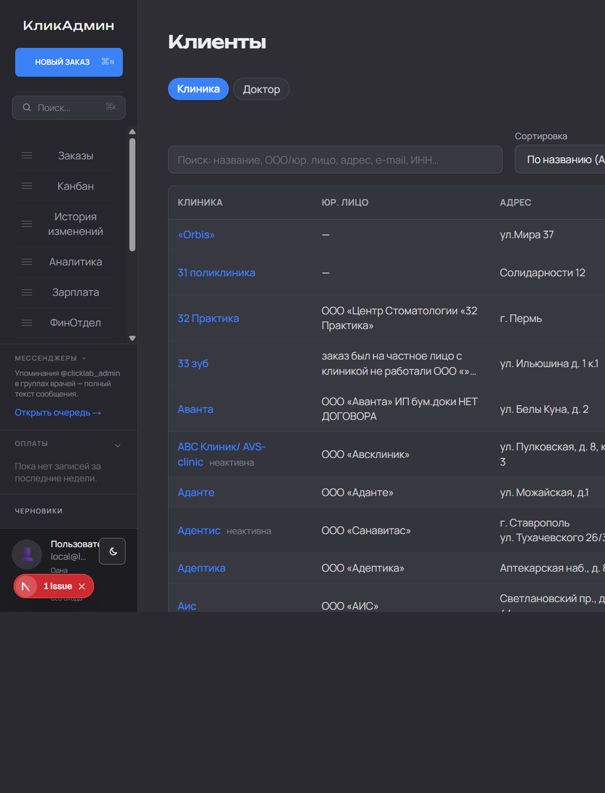
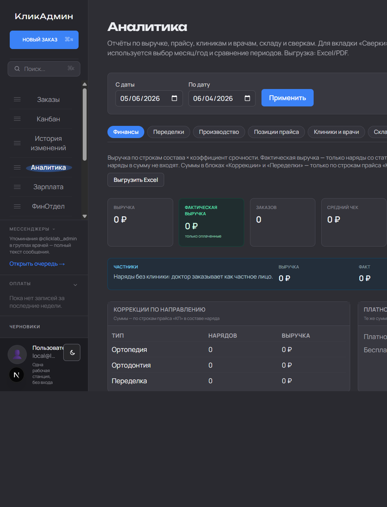
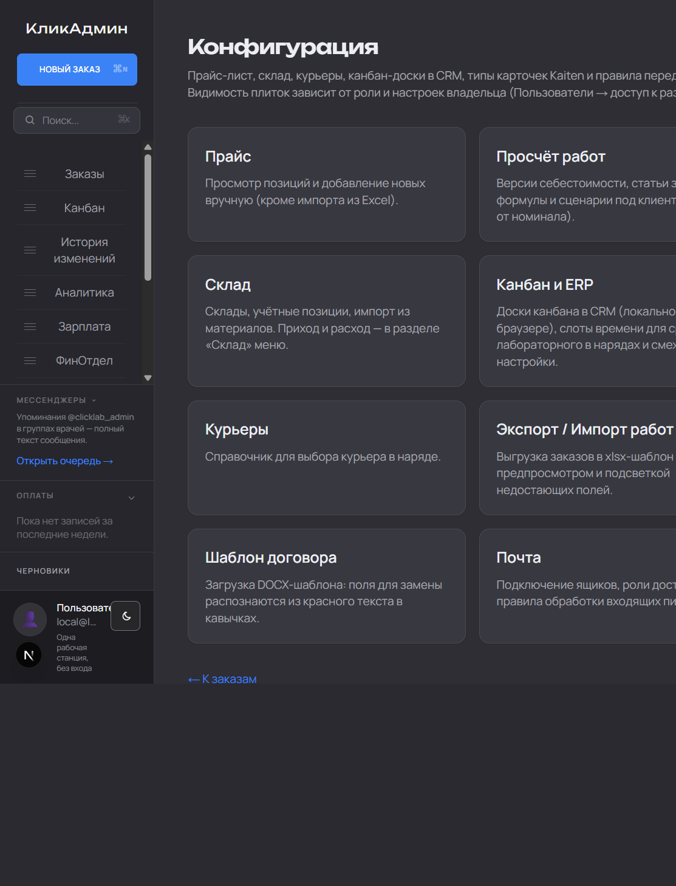
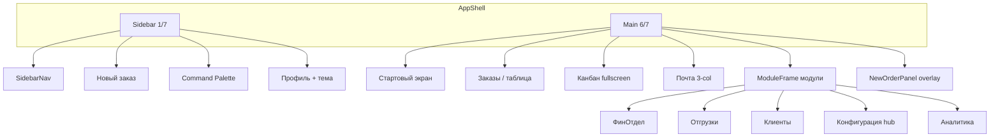

# Описание UI — КликАдмин (Dental Lab CRM)

Внутренняя CRM зуботехнической лаборатории. Интерфейс на **русском языке**, ориентирован на **десктопную работу** (широкие таблицы, плотные списки), с адаптацией под планшет и телефон.

---

## Скриншоты

Снимки лежат в [`docs/screenshots/`](screenshots/). Разрешение при съёмке: **1440×900**, десктопная оболочка (сайдбар 1/7). Большинство снято в **тёмной теме**; светлая тема переключается внизу сайдбара.

| Файл | Экран |
|------|--------|
| [`01-home.png`](screenshots/01-home.png) | Стартовый экран `/` |
| [`02-orders.png`](screenshots/02-orders.png) | Список заказов |
| [`03-kanban.png`](screenshots/03-kanban.png) | Канбан (доска «Ортопедия») |
| [`04-mail.png`](screenshots/04-mail.png) | Почта (пустое состояние без ящика) |
| [`05-directory.png`](screenshots/05-directory.png) | Конфигурация — hub плиток |
| [`06-finance-office.png`](screenshots/06-finance-office.png) | ФинОтдел |
| [`07-clients.png`](screenshots/07-clients.png) | Клиенты — вкладка «Клиника» |
| [`08-analytics.png`](screenshots/08-analytics.png) | Аналитика — вкладка «Финансы» |
| [`09-shipments.png`](screenshots/09-shipments.png) | Отгрузки — «Сегодня» |

### Обзор каркаса



*Слева — сайдбар (1/7): логотип, «Новый заказ», поиск, меню, мессенджеры, профиль. Справа — контент модуля (6/7).*

Как обновить скриншоты после изменений UI — см. [`docs/screenshots/README.md`](screenshots/README.md).

---

## Общий каркас приложения

### AppShell — двухколоночная оболочка

На «десктопной» оболочке (ширина ≥ 1024px **и** высота ≥ 560px):

| Зона | Доля экрана | Назначение |
|------|-------------|------------|
| Левый сайдбар | **1/7** (~14%) | Навигация, быстрые действия, профиль |
| Рабочая область | **6/7** (~86%) | Контент текущего модуля |

На узком окне, телефоне или низком экране (альбом):

- сайдбар **скрыт** и выезжает поверх контента;
- в левом верхнем углу — **кнопка «гамбургер»** (fixed, z-index 80);
- при открытом меню — **затемнённый оверлей**, контент приглушён;
- закрытие: клик по оверлею, смена страницы, **Escape**.

Страницы входа (`/login`) рендерятся **без сайдбара** — на всю ширину экрана.

Ключевые файлы: `components/layout/AppShell.tsx`, `components/layout/Sidebar.tsx`.

### Корневой layout

```
html (lang=ru)
└── body (Manrope, antialiased)
    └── AppProviders (тема, контексты)
        ├── ActiveUserGate
        ├── AppShell
        │   ├── Sidebar (aside, fixed слева)
        │   ├── main (контент модуля)
        │   ├── OrderCorrectionToastStack
        │   └── OrderBackgroundUploadToast
        └── ToastProvider (глобальные уведомления)
```

Файл: `app/layout.tsx`.

---

## Визуальный язык

### Брендинг

- **Отображаемое имя:** «КликАдмин» (`lib/app-brand.ts` → `APP_DISPLAY_NAME`)
- **Шрифты:**
  - основной текст — **Manrope** (Google Fonts, кириллица);
  - заголовки модулей и логотип в сайдбаре — **Unbounded**;
  - опционально Muller через локальные `@font-face` в `public/fonts/`.
- **Базовый размер:** `html { font-size: 110% }` — интерфейс чуть крупнее стандартного, без «разъезда» layout.

Файлы: `lib/app-fonts.ts`, `app/globals.css`.

### Цветовая система (CSS-переменные)

Светлая тема — **приглушённые серо-голубые** тона, без «кислотного» белого:

| Переменная | Назначение |
|------------|------------|
| `--sidebar-blue` / `--sidebar-blue-hover` | Акцент (#2563eb → hover) |
| `--sidebar-bg`, `--sidebar-border` | Фон и границы сайдбара |
| `--app-bg`, `--app-text` | Фон и текст рабочей области |
| `--card-bg`, `--card-border` | Карточки, плитки, панели |
| `--surface-hover`, `--table-row-hover` | Hover-состояния |
| `--input-bg`, `--input-border` | Поля ввода |
| `--text-muted`, `--text-secondary` | Вторичный текст |

Тёмная тема (`html.dark`) — **тёмно-серые слои** (zinc-подобные), не чистый чёрный OLED. Акцентный синий чуть ярче (#3b82f6).

### Тема

- Переключатель **светлая / тёмная** внизу сайдбара (иконка солнца/луны).
- Тема сохраняется в localStorage; при первой отрисовке — inline-скрипт в `<head>`, чтобы не было «мигания».

Файлы: `components/layout/ThemeToggle.tsx`, `components/providers/ThemeProvider.tsx`, `lib/theme-storage.ts`.

### Микроанимации

- Заголовок модуля — лёгкий **slide-in** (`module-frame-enter`, 200ms).
- Кнопки с классом `.pressable-tap` — **scale(0.97)** при нажатии.
- Активный пункт меню — «маркер» под текстом (кривой овал, градиент синего).
- Модальные панели «Новый заказ» — **Framer Motion** (AnimatePresence).

### Декоративные элементы

- В углу сайдбара (если включён флаг `isWorkdaySkyWidgetEnabled`) — виджет **WorkdaySunMoon** (день/ночь, погода СПб).
- Favicon — синие/белые PNG 48–144px.

---

## Левый сайдбар

Вертикальная колонка, три зоны. Файл: `components/layout/Sidebar.tsx`.

### Верх — бренд и главное действие

1. **Логотип/название** «КликАдмин» — ссылка на стартовый экран `/`, дисплейный шрифт, адаптивный размер через `clamp`.
2. **Кнопка «Новый заказ»** — синяя, uppercase, на всю ширину сайдбара.
   - До **5 одновременных** окон нового заказа; при лимите кнопка disabled с tooltip.
   - Скрыта для пользователей «только канбан».

### Середина — навигация и виджеты

1. **Command Palette** — поле «Поиск…» (открывает модальное окно по клику).
2. **SidebarNav** — основные разделы.
3. **SidebarMessengers** — блок мессенджеров (Telegram и др.).
4. **SidebarPayments** — сворачиваемый список недавних оплат (если есть доступ).
5. **SidebarDrafts** — черновики заказов; при наличии черновиков блок подсвечивается **красной** полосой слева.

### Низ — профиль

- Аватар (emoji-пресет или загруженное фото) → `/directory/profile`.
- Имя, email.
- Бейдж **«Демо»** (amber) в demo-режиме.
- Подпись **«Одна рабочая станция, без входа»** в portable/single-user режиме.
- Переключатель темы.
- Кнопка **«Выйти»** / **«Выйти из демо»**.

### Пункты основного меню

| Раздел | Путь | Модуль RBAC |
|--------|------|-------------|
| Заказы | `/orders` | `ORDERS` |
| Канбан | `/kanban` | `KANBAN` |
| История изменений | `/orders/history` | `ORDER_HISTORY` |
| Аналитика | `/analytics` | `ANALYTICS` |
| Зарплата | `/payroll` | `PAYROLL` |
| ФинОтдел | `/finance-office` | `FINANCE_OFFICE` |
| Почта | `/mail` (+ badge непрочитанных) | `MAIL` |
| Отгрузки | `/shipments` | `SHIPMENTS` |
| Склад | `/warehouse` | `WAREHOUSE` |
| Клиенты | `/clients` | `CLIENTS_VIEW` |
| Конфигурация | `/directory` | `DIRECTORY` |

- Видимость пунктов зависит от **роли** и **матрицы доступа к модулям** (`AppModule`).
- Порядок пунктов **перетаскивается** (drag handle); порядок сохраняется на сервере (`/api/me/sidebar-nav-order`) и в localStorage.
- Активный пункт — маркер + более яркий текст.

Файл: `components/layout/SidebarNav.tsx`.

---

## Шаблон страницы модуля — ModuleFrame

Стандартная обёртка для большинства разделов (кроме канбана и почты).

```
┌─────────────────────────────────────────────────────────┐
│  [h1 Заголовок]  [пилюли/статус]     [кнопки справа]   │
│  подстрочник / описание                                 │
├─────────────────────────────────────────────────────────┤
│                                                         │
│  контент модуля (таблица, форма, сетка плиток…)         │
│                                                         │
└─────────────────────────────────────────────────────────┘
```

**Props:**

- `title` — заголовок h1 (Unbounded, `text-xl` / `lg:text-2xl`).
- `titleSubline` — тонкая подсказка под заголовком.
- `titleAccessory` — пилюли статуса слева от кнопок.
- `titleBesideEnd` — ссылка рядом с h1 («Архив» и т.п.).
- `titleRowEnd` — кнопки действий справа («Сохранить»).
- `description` — абзац описания.
- `headerClassName` — sticky-шапка (например, на карточке наряда).

Отступы: адаптивные `px-3 … lg:px-10`, на landscape/низком экране — компактнее.

Файл: `components/layout/ModuleFrame.tsx`.

---

## UI-kit (`components/ui/`)

Общие компоненты:

| Компонент | Назначение |
|-----------|------------|
| `Button` | primary / secondary / ghost / danger / warning; размеры xs–lg; loading, iconLeft/Right |
| `Badge` | метки, статусы |
| `FilterBadge` | активные фильтры с крестиком сброса |
| `Spinner` | индикатор загрузки |
| `Separator` | горизонтальный/вертикальный разделитель |
| `DateRangePresets` | пресеты периодов (сегодня, неделя, месяц…) |
| `CommandPalette` | глобальный поиск |
| `ToastProvider` + `toast()` | всплывающие уведомления |

Стили опираются на CSS-переменные темы, без отдельной UI-библиотеки (не MUI/Chakra).

Экспорт: `components/ui/index.ts`.

---

## Глобальные паттерны взаимодействия

### Command Palette

- Модальное окно по центру (Framer Motion).
- Поиск от 2 символов с debounce 200ms → `/api/search`.
- Результаты: **заказы**, **клиники**, **врачи**.
- В открытой палитре: стрелки и Enter для выбора результата, Escape — закрыть.

Файл: `components/ui/CommandPalette.tsx`.

### Toast-уведомления

- Глобальный `ToastProvider` (правый нижний угол).
- Отдельные стеки: **корректировки заказов** (`OrderCorrectionToastStack`), **фоновая загрузка вложений** (`OrderBackgroundUploadToast`).

### Панели «Новый заказ»

- До **5 параллельных** окон (`NEW_ORDER_PANEL_MAX`).
- **Развёрнутое** — модальная панель поверх контента; на десктопе **не перекрывает сайдбар** (сдвиг `left: 1/7`).
- **Свёрнутое** — синие полоски внизу экрана (стек с offset).
- Режим **из почты** — двухколоночный layout: форма заказа + колонка исходного письма.
- При смене маршрута развёрнутые панели **автосворачиваются**.

Файлы: `components/orders/NewOrderPanel.tsx`, `components/orders/new-order-panel-context.tsx`, `components/orders/new-order-form/NewOrderForm.tsx`.

---

## Стартовый экран (`/`)

Центрированная «домашняя» страница без ModuleFrame:

1. **Приветствие** — крупный заголовок «Привет, {имя}» в карточке по центру.
2. **DashboardActions** — быстрые действия (новый заказ, отгрузки, «обратите внимание»).
3. Для **OWNER** — переключатель **«Смотреть как роль»** (view-as-role).

Файлы: `app/page.tsx`, `components/home/DashboardActions.tsx`, `components/home/OwnerViewAsRoleControl.tsx`.

---

## Модули — особенности UI

### Заказы (`/orders`)



- **Плотная таблица** на всю ширину рабочей области (`table-fixed`, `min-w-[56rem]`).
- Адаптивный размер шрифта: `10px → 13px` на 2xl.
- **StickyListChrome** — липкая шапка с фильтрами при прокрутке.
- **OrdersListFiltersBar** — поиск, теги, период, быстрые фильтры (корректировки, протетика, упоминания Kaiten).
- Колонки: номер, срок, клиника/врач/пациент, теги, чат Kaiten, отгрузка, печать (наряд, QR, стикер).
- **OrderListTagsCell**, **OrderListOrderChatCell** — инлайн-индикаторы статусов.
- Фоновый **Kaiten poller** обновляет колонки и чаты без перезагрузки.

Ключевые файлы: `app/orders/page.tsx`, `components/orders/OrdersListTableRow.tsx`, `components/orders/OrdersListFiltersBar.tsx`.

### Карточка заказа (`/orders/[id]`)

- **OrderEditForm** — многосекционная форма (клиника, состав, сроки, вложения, счёт).
- **OrderEditPageLayoutGrid** — сетка полей.
- Sticky-шапка ModuleFrame с кнопками сохранения.
- Встроенный чат Kaiten/канбан, QR, печать PDF наряда.

### Канбан (`/kanban`)



- **Полноэкранный** модуль без ModuleFrame; корень `.kanban-root`.
- Собственная палитра CSS-переменных (стиль, близкий к Kaiten).
- Горизонтальные **колонки** с карточками, drag-and-drop (`@dnd-kit`).
- Модалка карточки — двухколоночная (контент + чат/комментарии).
- Фильтры, режим **СТОП**, production-checklist, таймер обратного отсчёта.
- Поддержка светлой/тёмной темы через `.kanban-root` variables.

Ключевые файлы: `app/kanban/page.tsx`, `components/kanban/KanbanApp.tsx`, `app/globals.css` (секция `.kanban-root`).

### Почта (`/mail`)



Трёхколоночный desktop-layout (xl+):

```
┌──────────┬─────────────┬──────────────────┐
│ MailSidebar │ MailList  │   MailViewer     │
│ (папки,   │ (список     │ (тело письма,    │
│  метки)   │  писем)     │  вложения)       │
└──────────┴─────────────┴──────────────────┘
```

- **MailHeader** — выбор ящика, синхронизация, compose.
- Список писем — **resizable** (drag handle между list и viewer).
- На экранах < xl viewer открывается отдельно/overlay.
- **MailComposer** — модальное окно отправки (TipTap rich text).
- Drag-and-drop меток/папок (`@dnd-kit`).
- Создание заказа из письма → панель NewOrderPanel с sourceEmails.

Ключевые файлы: `app/mail/page.tsx`, `components/mail/MailLayout.tsx`, `components/mail/MailSidebar.tsx`, `components/mail/MailList.tsx`, `components/mail/MailViewer.tsx`.

### ФинОтдел (`/finance-office`)



- Таблица заказов с фильтрами по датам и тегам.
- Импорт банковской выписки, preview, отметки оплаты.
- Индикаторы корректировок и протетики.

Ключевые файлы: `app/finance-office/page.tsx`, `components/finance-office/FinanceOfficeOrdersTable.tsx`.

### Отгрузки (`/shipments`, `/shipments/today`, `/tomorrow`, `/period`)



- Вкладки/фильтры по датам сдачи.
- Массовая печать нарядов, QR, стикеров.
- Отметка «отправлено».

Ключевые файлы: `app/shipments/**`, `components/shipments/ShipmentsOrdersTable.tsx`.

### Клиенты (`/clients`)



- Списки клиник и врачей.
- Карточки с реквизитами, коммерческими условиями, Telegram-группами.
- История изменений (`/clients/history`).

Ключевые файлы: `app/clients/**`, `components/clients/**`.

### Аналитика (`/analytics`)



- Дашборд с **Recharts** (графики, агрегаты).
- Фильтры по периодам.

Ключевые файлы: `app/analytics/page.tsx`, `components/analytics/AnalyticsPageClient.tsx`.

### Склад (`/warehouse`, `/directory/warehouse`)

- Таблицы позиций, остатков, движений.

Ключевые файлы: `app/warehouse/page.tsx`, `components/inventory/**`.

### Зарплата (`/payroll`)

- Панель сделочных начислений, расчётные блоки.

Ключевые файлы: `app/payroll/page.tsx`, `components/payroll/**`.

### Конфигурация (`/directory`)



- **Hub-страница** — сетка плиток (`grid sm:2 lg:3`).
- Каждая плитка — карточка с заголовком и описанием, hover с синей рамкой.
- Подразделы: прайс, себестоимость, пользователи, канбан-доски, Kaiten, курьеры, печать, договоры, импорт/экспорт, почта (owner).

Ключевые файлы: `app/directory/page.tsx`, `app/directory/**`.

### Обратите внимание (`/attention`)

- Список напоминаний и задач, требующих реакции.

### Мессенджеры (`/messengers`)

- Интеграция Telegram: группы врачей, уведомления.

---

## Вход и авторизация

| Страница | UI |
|----------|-----|
| `/login` | Центрированная форма «Вход в CRM» |
| `/login/activate` | Активация по invite-коду |
| `/login/telegram-link` | Привязка Telegram |

- Email + пароль, Telegram Widget.
- Demo-режим с отдельной базой и amber-бейджем в сайдбаре.
- Portable single-user — без экрана входа.

Ключевые файлы: `app/login/**`, `components/auth/**`.

---

## Адаптивность и breakpoints

| Условие | Поведение |
|---------|-----------|
| `shell-desktop` (≥1024px × ≥560px) | Фиксированный сайдбар 1/7 |
| `< 1024px` или высота `< 560px` | Выезжающее меню, гамбургер |
| `shell-short` (высота ≤ 560px) | Компактный сайдбар, меньшие отступы |
| `landscape:max-lg` | Уменьшенные padding в ModuleFrame |

Custom variants в `app/globals.css`: `@custom-variant shell-desktop`, `@custom-variant shell-short`.

Safe-area insets учитываются для iPhone (notch, home indicator).

---

## Печать

- Отдельные print-friendly страницы: наряд, QR, стикеры (`/shipments/stickers-print`).
- Классы `no-print` на элементах, которые не должны попадать в печать.

---

## Роли и персонализация UI

- **Матрица модулей** — владелец включает/выключает разделы по ролям; меню и API фильтруются.
- **Kanban-only** — урезанный сайдбар (только канбан ± зарплата).
- **View-as-role** (owner) — просмотр интерфейса глазами другой роли.
- Порядок пунктов меню — **индивидуальный** на пользователя.
- Тема — **индивидуальная** (localStorage).

Ключевые файлы: `lib/role-module-defaults.ts`, `components/directory/RoleModuleAccessMatrix.tsx`, `middleware.ts`.

---

## Схема информационной архитектуры



---

## Связанные документы

- [`docs/crm-technical-overview.md`](crm-technical-overview.md) — техническая структура, API, доменный слой.
- [`docs/screenshots/README.md`](screenshots/README.md) — как обновить скриншоты.
- [`docs/tenant-boundary.md`](tenant-boundary.md) — граница lab/SaaS.
- [`README.md`](../README.md) — первый запуск и команды.

---

*Документ описывает UI по состоянию репозитория dental-lab-crm. При существенных изменениях интерфейса обновляйте этот файл вместе с PR.*
