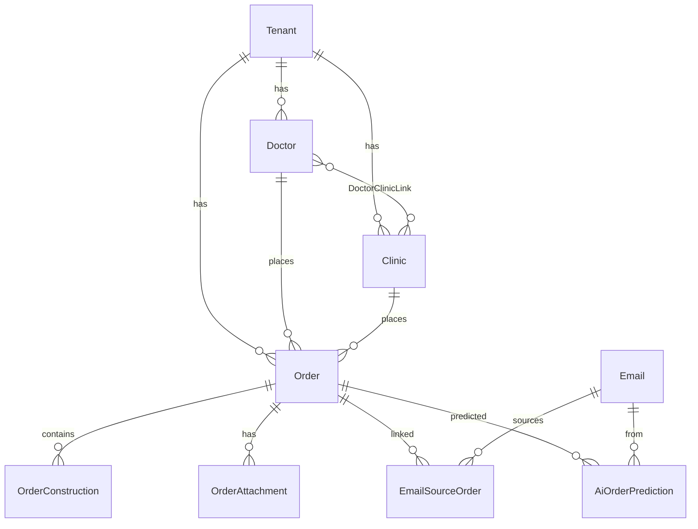

# Том 2. Модель данных (Prisma)

Источник истины: `prisma/schema.prisma` (~2200+ строк).

---

## 2.1. Multi-tenancy

### Tenant

```
model Tenant {
  id, slug (unique subdomain), name
  plan: SubscriptionPlan (BASIC | OPTIMAL | ULTRA)
  tenantDatabaseUrl, tenantDatabaseEnabled, tenantDatabaseReadyAt  // per-DB SaaS
  addonKanban, kaitenIntegrationEnabled, kaitenIntegrationDisabledAt
  aiEnabled, aiApiKey, aiModel
  kanbanAdminMentionTag, labDueHmSlots (JSON), productionCalendarCountry
  orderArchiveRetentionDays
  adminSharedTelegramChatId, adminSharedMessengerNotifyPrefs
  subscriptionValidTo
}
```

**Lab:** один tenant, пользователь не выбирает организацию.  
**SaaS:** `slug` из host header (`lib/tenant-slug.ts`).

---

## 2.2. Заказы (ядро CRM)

### Order

Ключевые поля:

| Поле | Тип | Смысл |
|------|-----|-------|
| `orderNumber` | String | `YYMM-NNN` (см. `lib/order-number.ts`) |
| `tenantId` | String | Изоляция |
| `clinicId`, `doctorId` | String? | Заказчик |
| `patientName` | String? | Пациент |
| `status` | OrderStatus | Жизненный цикл |
| `labWorkStatus` | LabWorkStatus | Производство |
| `dueDate` | DateTime? | Срок лаборатории |
| `dueToAdminsAt` | DateTime? | Запись/доставка админам |
| `workReceivedAt` | DateTime? | Поступление работы |
| `adminShippedAt` | DateTime? | Отгрузка админом |
| `isUrgent`, `urgentCoefficient` | | Срочность |
| `clientOrderText` | Text | Дословный заказ клиента |
| `payment`, `paymentPartialRub` | | Оплата |
| `hasScans`, `hasCt`, `hasMri`, `hasPhoto` | Boolean | Флаги материалов |
| `kaitenCardId`, `kaitenColumnTitle` | | Зеркало Kaiten |
| `kaitenCardTitleMirror` | | Кэш заголовка |
| `demoKanbanColumn` | | CRM kanban без Kaiten |
| `continuesFromOrderId` | | Продолжение работы |
| `archivedAt` | | Архив |
| `stickerPublicToken` | | Публичный стикер |

Связи: `constructions[]`, `attachments[]`, `emailSourceOrders[]`, `aiOrderPredictions[]`, `revisions[]`.

### OrderConstruction

```
model OrderConstruction {
  orderId
  category: FIXED | BRIDGE | PRICE_LIST | ...
  constructionTypeId?, priceListItemId?, materialId?
  teethFdi: Json (string[] в приложении)
  bridgeFromFdi, bridgeToFdi, arch (JawArch)
  quantity, unitPrice, lineDiscountPercent
}
```

**Инвариант:** `teethFdi` в БД как `Json`; в TypeScript нормализуется в `string[]`.

### OrderAttachment

```
diskRelPath: "s3:orders/..." | "orders/{id}/{attId}"
data: Bytes? (inline для мелких)
scope: GENERAL | INVOICE | ...
```

### OrderRevision

История изменений (`lib/record-order-revision.ts`): CREATE, SAVE, RESTORE.

---

## 2.3. Клиенты

### Clinic

Реквизиты, `worksWithReconciliation`, `reconciliationFrequency`, `billingLegalForm`, soft-delete `deletedAt`.

### Doctor

`fullName`, контакты, `aiParticulars`, `aiLessons` (короткая память ИИ), `acceptsPrivatePractice`, `orderPriceListKind`.

### DoctorClinicLink

M:N врач ↔ клиника.

---

## 2.4. Почта

### EmailAccount

IMAP/SMTP credentials (encrypted), `allowedRoles`, sync mode.

### EmailFolder

IMAP folder mirror: `imapName`, `uidValidity`, `lastSyncedUid`, counters.

### Email

```
uid, messageId, direction (INBOUND/OUTBOUND)
isRead, readAt  // только явное действие пользователя!
textBody, htmlBody, preview, subject
fromAddress, receivedAt
```

Индексы: по `tenantId, accountId, receivedAt`, `isRead`, `folderId`.

### EmailSourceOrder

Связь письма с нарядом. `isReplyTarget` — для автоответа.

### EmailSyncJob

Очередь синхронизации (`lib/mail/mail-queue.ts`).

---

## 2.5. ИИ (Shadow Mode)

### AiOrderPrediction

```
orderId, emailId (unique pair)
model, durationMs
predictionJson: Json  // полный enriched ответ
error: String?
selfCorrectionAt: DateTime?
selfCorrectionRefHash: String?  // снимок состава эталона
```

**Инвариант:** `selfCorrectionRefHash` = sorted summary состава админа (`lib/llm/prediction-composition-summary.ts`).

### Doctor.aiLessons

До 5 строк текста, разделитель `\n`. Подставляется в промпт следующих писем врача.

---

## 2.6. Kaiten / Kanban

### KaitenCardType

`externalTypeId` ↔ Kaiten API `type_id`.

### Order (Kaiten fields)

`kaitenCardId`, `kaitenColumnTitle`, `kaitenBlockedAt`, chat sync timestamps.

### OrderChatCorrection

Заявка из чата Kaiten при сигнале `!!!`.

### OrderProstheticsRequest

Заявка при сигнале `???`.

### OrderChatInboxItem

Inbox для админа (упоминания, корректировки).

### KanbanStandaloneCard

Карточки CRM kanban без привязанного Order.

---

## 2.7. Финансы и склад

### ReconciliationSnapshot

Авто/ручные снимки сверок (xlsx в БД).

### PayrollEntry, PayrollConfig

Расчёт зарплат.

### InventoryItem, InventoryMovement, InventoryBalance

Складские остатки и движения.

### PriceListItem

Прайс: `code`, `name`, `priceRub`, `leadWorkingDays`, variable price flags.

---

## 2.8. RBAC

### AppModule (enum)

Атомарные модули: `ORDERS`, `CLIENTS`, `MAIL`, `KANBAN`, `FINANCE_OFFICE`, `AI_ADMIN`, ...

### RoleModuleAccess

```
tenantId + role + module → allowed: Boolean
```

Override поверх defaults (`lib/role-module-defaults.ts`).

---

## 2.9. ER-диаграмма (упрощённая)



---

## 2.10. Индексы и производительность

- Списки нарядов: индексы по `tenantId`, `dueDate`, `archivedAt`.
- Почта: составные индексы `(tenantId, accountId, receivedAt, id)`.
- AI predictions: `(tenantId, createdAt)`.

**SQLite legacy:** в коде остались упоминания busy/retry — на PostgreSQL не актуально, но паттерн транзакций сохранён.
